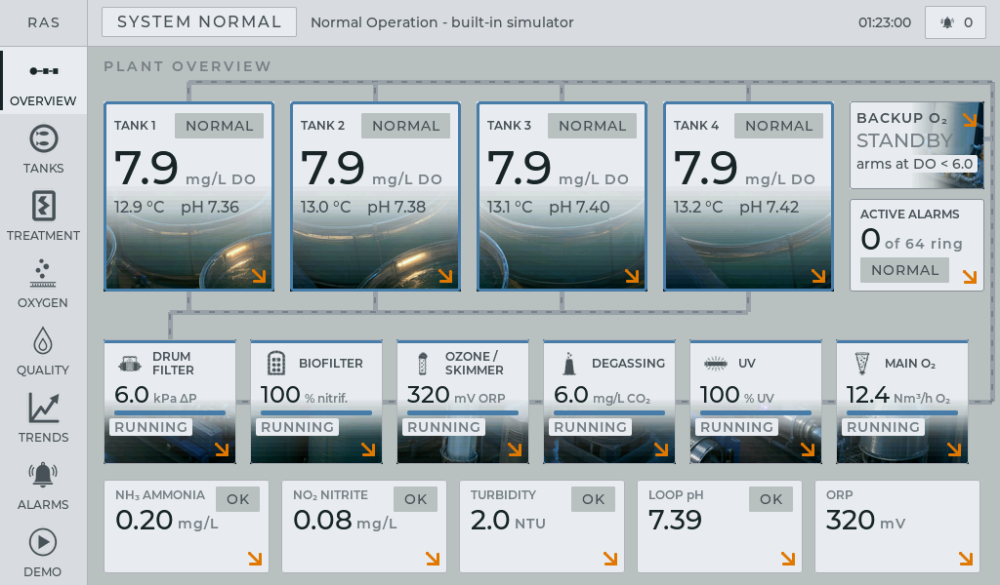
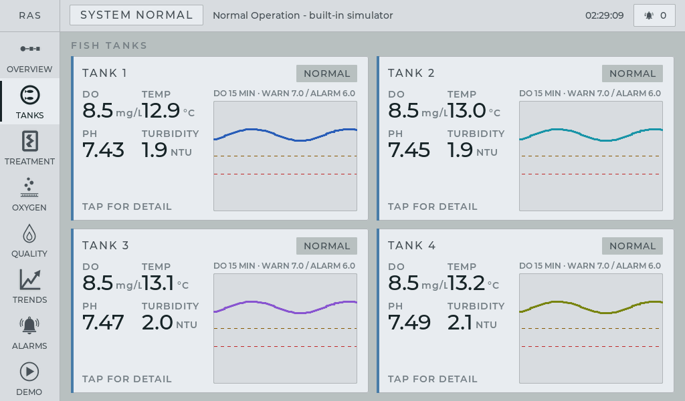
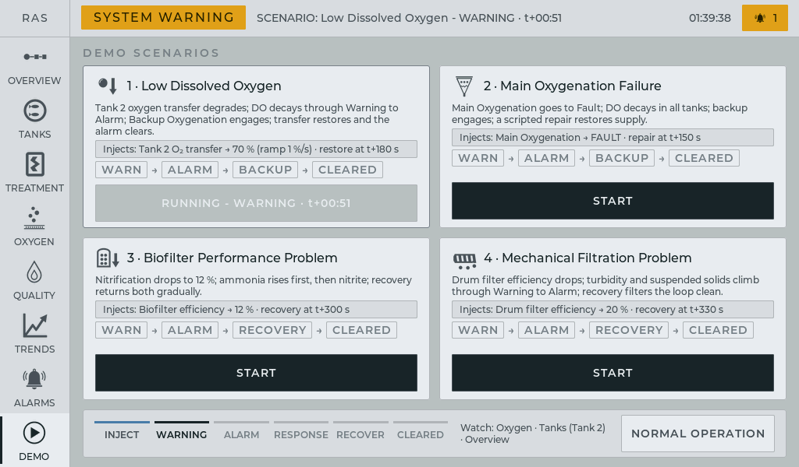
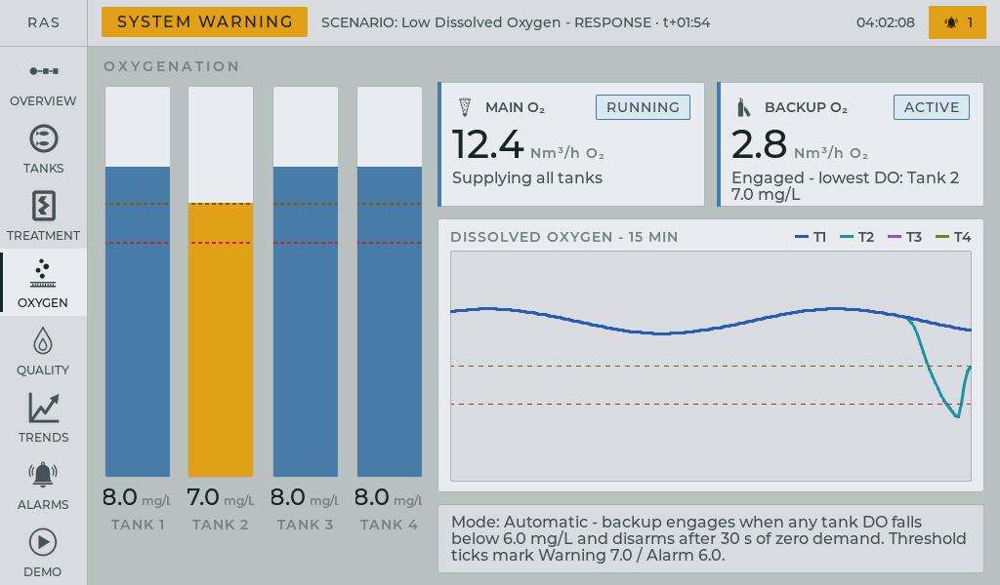
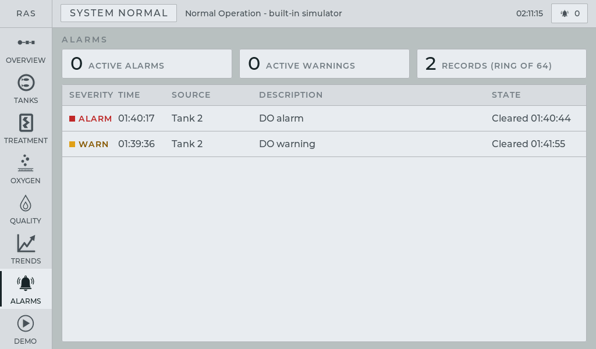
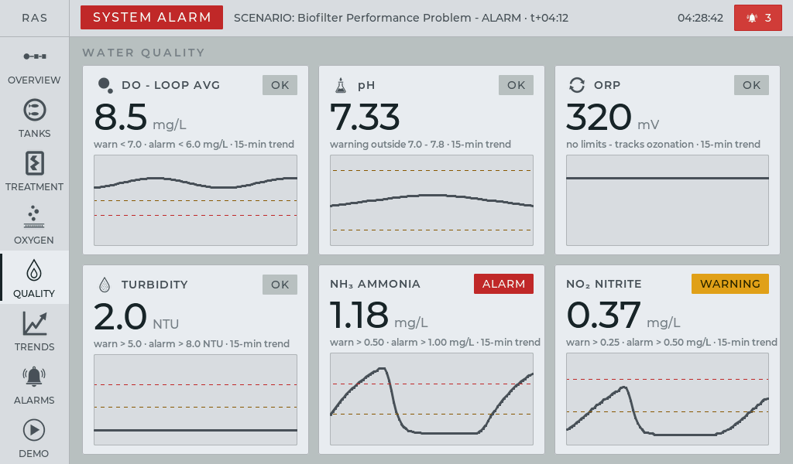

# RAS Control HMI

Monitoring and control of a recirculating aquaculture system (RAS) - a working demonstration of the touchscreen HMI. It runs on the Elecrow CrowPanel Advance **10.1"** ESP32-P4 touch panel with the 1024x600 display.

The plant is a four-tank RAS with its full water-treatment loop - drum filter, biofilter, ozonation, degassing, UV, oxygenation - **simulated on the device**. Water quality drifts, equipment runs, alarms are raised and the backup oxygenation reacts, all from a built-in process model: no PLC, no sensors, no network required.

## What's in the package

- `ras_flash_tool.exe`: one-click flasher, demo firmware built in
- `README.md`: this file
- `img/`: the screenshots used below

## Installing the demo on the panel (one time)

1. Double-click `ras_flash_tool.exe`. It scans the serial ports by itself (there is nothing to select or configure) and waits for the panel.
2. Connect the panel to the PC with a USB-C cable. The board has **two USB-C sockets: use the UART0 one**. The tool finds the board automatically, writes the firmware and prints **Done**; the panel then restarts into the demo.
3. If the tool keeps waiting - try installing the standard **CH340** USB serial driver and run it again.

Flashing replaces the previous firmware entirely; there is nothing to erase or reset first.

## What the panel shows after it boots

The demo opens with a **four-slide intro** that introduces the product: what the HMI is, what it covers, the built-in process simulation, and the connectivity options (wired Modbus/analog next to LoRaWAN wireless sensors and controllers). Each slide turns on its own after eight seconds; tap or swipe left to go on, swipe right to go back. After the last slide the HMI opens with the plant already running. The same four slides are in **slides.pdf** next to this README, one per page.

To replay the intro at any time, press and hold the **clock in the top-right corner** for one second.

## The main screen

Everything is operated by finger, like a phone:

- **Left rail**: the eight screens - **Overview**, **Tanks**, **Treatment**, **Oxygen**, **Quality**, **Trends**, **Alarms**, **Demo**
- **Top bar**: the plant state banner (`SYSTEM NORMAL` / `WARNING` / `ALARM`), the running scenario and its timer, the alarm counter (tap it to jump to **Alarms**) and the demo clock
- **Overview**: the four tanks on the supply manifold, the treatment chain in flow order with the flow marching along the pipes, Backup O₂ and the loop-chemistry strip

The colours follow the ISA-101 convention: a normally running plant is calm and gray, and only deviations carry colour - amber for a warning, red for an alarm, magenta for an equipment fault. Every card on the overview is a door (the small orange arrow in its corner): tap a tank to open its detail, a treatment unit to open **Treatment**, Backup O₂ to open **Oxygen**, a chemistry tile to open **Quality**.

## Things to try

### **1. Look around the running plant.**
Tap through the rail. **Tanks** shows a card per tank with dissolved oxygen, temperature, pH and turbidity; tap a card for the large values, their 15-minute sparklines and the alarms that mention this tank. **Treatment** lists the five units in chain order with state, efficiency and their own parameters (drum filter ΔP and flushes, biofilter nitrification, UV lamp intensity...). **Quality** is the loop chemistry: DO, pH, ORP, turbidity, ammonia, nitrite, each with its limits and a trend. Nothing is frozen - the fish feed, the values breathe.

### **2. Start a fault scenario.**
Open **Demo**. Four scenarios are listed, each with what it injects and where to watch. Tap **START** on *1 · Low Dissolved Oxygen*: tank 2's oxygen transfer starts degrading. The card shows the phase the story is in - inject, warning, alarm, backup response, recovery, cleared - and the top bar shows the scenario clock.

### **3. Watch the plant respond.**
Go to **Oxygen**: four DO gauges against the 7.0 / 6.0 warning and alarm ticks. Tank 2 sinks, the banner goes `SYSTEM WARNING`, then `SYSTEM ALARM`; the moment DO drops below the alarm line **Backup O₂** flips from `STANDBY` to `ACTIVE` and starts feeding the tank. DO climbs back, the alarm clears, the banner returns to `SYSTEM NORMAL`. The whole arc takes about 75 seconds - the demo clock runs about 4x faster than real time, so a minutes-long process story fits a conversation.

The same story reads on **Overview** (the backup block lights up and feeds the riser) and on **Tanks** (tank 2 goes amber, then red, then gray again).

### **4. Read the record.**
**Alarms** keeps every raise and clear with its time, source and severity; active alarms are pinned on top. **Trends** plots the 15-minute history of DO, temperature, pH or turbidity for one tank or all four, with the warning and alarm guide lines dashed in.

### **5. Try the other scenarios.**

- **Main Oxygenation Failure**: the main unit goes to fault and all four tanks decay together; the backup carries the plant until a scripted repair. Watch **Oxygen** and **Treatment**.
- **Biofilter Performance Problem**: nitrification collapses; ammonia rises first, nitrite follows, and both come back slowly after recovery. Watch **Quality** and **Treatment**.
- **Mechanical Filtration Problem**: the drum filter loses efficiency and turbidity climbs through warning to alarm. Watch **Quality** and **Treatment**.

Each completes in about two minutes and returns the plant to normal by itself. **NORMAL OPERATION** on the Demo screen aborts a running scenario at once.

Every run of a scenario is identical: the simulator is deterministic, so what you show is exactly what you rehearsed.

## Demo scope

The screens, the alarm engine with its persistence and hysteresis, the trends and the backup-oxygenation logic shown here are the real thing; only the process physics are simulated for the demo. Connecting to a real plant - over Modbus, analog inputs or LoRaWAN field devices - is a configuration of the same firmware, not a rewrite.
